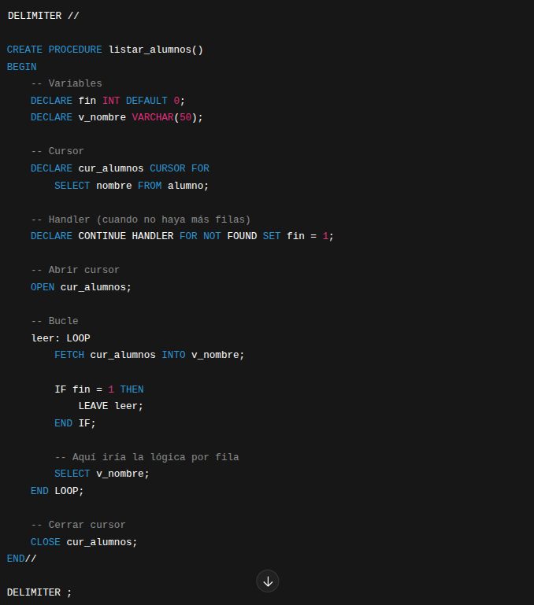

# Cursores

**Los cursores solo se pueden usar en procedimientos o funciones**
**Siempre siguen este orden:**

- `DECLARE`
- `OPEN`
- `FETCH`
- `CLOSE`

**Se usan junto con bucles (`WHILE`, `LOOP`)**

| Comando                    | Descripción                                                | Ejemplo                                                     |
| -------------------------- | ---------------------------------------------------------- | ----------------------------------------------------------- |
| `DECLARE cursor`           | Declara un cursor asociado a una consulta `SELECT`.        | `DECLARE cur_alumnos CURSOR FOR SELECT nombre FROM alumno;` |
| `DECLARE CONTINUE HANDLER` | Define qué hacer cuando no hay más filas (`NOT FOUND`).    | `DECLARE CONTINUE HANDLER FOR NOT FOUND SET fin = 1;`       |
| `OPEN`                     | Abre el cursor y ejecuta el `SELECT`.                      | `OPEN cur_alumnos;`                                         |
| `FETCH`                    | Lee la siguiente fila del cursor y la guarda en variables. | `FETCH cur_alumnos INTO v_nombre;`                          |
| `CLOSE`                    | Cierra el cursor y libera recursos.                        | `CLOSE cur_alumnos;`                                        |

## Ejemplo:

